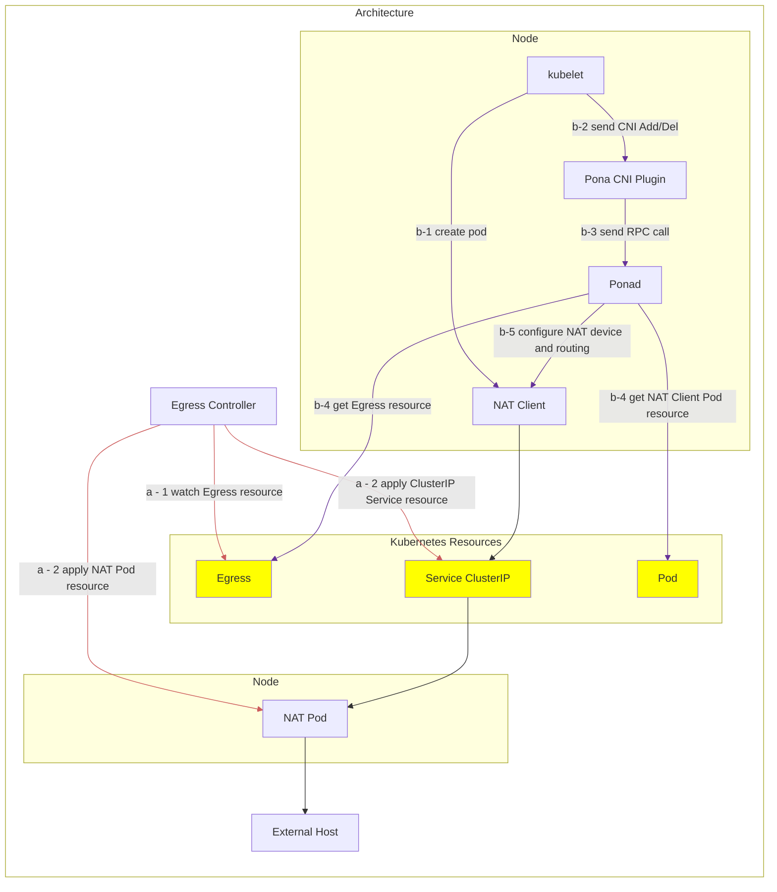

# Design notes

## Overview

In environments where Nodes and Pods only have private IP addresses, communication to the external networks requires source network address translation (SNAT).
If the underlying network provides SNAT, there is no problem. But if not, we need to somehow implement SNAT on Kubernetes.

Pona provides a SNAT routers on Kubernetes.  
This feature is on-demand because admins can allow only a subset of pods to use SNAT routers.

[Coil](https://github.com/cybozu-go/coil) has a similar feature, but it is tightly coupled to Coil's system and shares same life-cycle.  
Pona is designed to be a standalone feature that can be used independently of Coil.

## Architecture



### How Pona works

Users can create a NAT Pod with a Egress Custom Resource.
When a Egress resource is created, the Egress Controller creates a NAT Pod and a ClusterIP Service (`a-1`, `a-2`).

When a user want to send a request with NAT, the user creates a NAT client Pod with an annotation.  
Ponad which is deployed as daemonset, watches Pod resources.  
When a Pod with the annotation is created, Ponad configures the Pod to be routed to NAT Pod via the ClusterIP Service.
When a NAT client Pod is deleted, Pona CNI plugin is received a CNI Del and Ponad removes the configuration and NAT Pod removes the configuration corresponding to the NAT client (`b-1`, `b-2`, `b-3`, `b-4`).

A request from a NAT client Pod is routed to the NAT Pod via the ClusterIP Service, and the NAT Pod performs SNAT and sends the request to the external host.

Pona uses FoU (Foo-over-UDP) to route packets between NAT client Pod and NAT Pod as.
See [Coil's design docs](https://github.com/cybozu-go/coil/blob/main/docs/design.md#foo-over-udp-tunnel) for the reasons why FoU is adopted.

However, Pona does not have IPAM functionality.  
NAT Pods' IP addresses can be managed by using CNI plugins' feature such as [Coil AddressPool](https://github.com/cybozu-go/coil/blob/main/docs/usage.md#address-pools) or [Cilium Multi-Pool IPAM](https://docs.cilium.io/en/latest/network/concepts/ipam/multi-pool/).

### Components

#### Egress Controller
- It Watches Egress resources and creates NAT Pods and ClusterIP Services.

#### NAT Pod
- It is a Pod that performs SNAT for NAT client Pods.
- It configures MASQUERADE in iptables and FoU device at start-up

#### Pona CNI Plugin
- It is a CLI tool that is satified CNI spec interface.
- It delegates CNI calls to Ponad on the same node via an RPC call.
- It is designed to be used in CNI chains and does not have IPAM functionality.

#### Ponad
- It is deployed as a daemonset pod and runs on each node.
- It configures network device and routing in the network namespace of a NAT client Pod via RPC calls from the Pona CNI Plugin.
- It also watches Pod and Egress resources and configures NAT client Pods when those resources are changed.

### API 

#### Egress Custom Resource 

Egress resources have the following fields as well as Coil's Egress.

| Field                   | Type                      | required | Description                                                     |
|-------------------------|---------------------------|----------|-----------------------------------------------------------------|
| `destinations`          | `[]string`                | true     | IP subnets where the packets are SNATed and sent.               |
| `replicas`              | `int`                     | false    | Copied to Deployment's `spec.replicas`.  Default is 1.          |
| `strategy`              | [DeploymentStrategy][]    | false    | Copied to Deployment's `spec.strategy`.                         |
| `template`              | [PodTemplateSpec][]       | false    | Copied to Deployment's `spec.template`.                         |
| `sessionAffinity`       | `ClusterIP` or `None`     | false    | Copied to Service's `spec.sessionAffinity`.  Default is `None`. |
| `sessionAffinityConfig` | [SessionAffinityConfig][] | false    | Copied to Service's `spec.sessionAffinityConfig`.               |
| `podDisruptionBudget`   | `EgressPDBSpec`           | false    | `minAvailable` and `maxUnavailable` are copied to PDB's spec.   |

[DeploymentStrategy]: https://kubernetes.io/docs/reference/generated/kubernetes-api/v1.30/#deploymentstrategy-v1-apps
[PodTemplateSpec]: https://kubernetes.io/docs/reference/generated/kubernetes-api/v1.30/#podtemplatespec-v1-core
[SessionAffinityConfig]: https://kubernetes.io/docs/reference/generated/kubernetes-api/v1.30/#sessionaffinityconfig-v1-core


Here is an example of Egress resource.

```yaml
apiVersion: pona.cybozu.com/v1
kind: Egress
metadata:
  namespace: egress
  name: egress
spec:
  destinations:
  - 172.20.0.0/16
  - fd04::/64
  replicas: 3
  strategy:
    type: RollingUpdate
    rollingUpdate:
      maxUnavailable: 2
      maxSurge: 0
  template:
    metadata:
      annotations:
        ann1: foo
      labels:
        label1: bar
    spec:
      containers:
      - name: egress
        resources:
          limits:
            memory: 400Mi
  sessionAffinity: ClientIP
  sessionAffinityConfig:
    clientIP:
      timeoutSeconds: 43200
  podDisruptionBudget:
    maxUnavailable: 1
```

#### Annotations
To use NAT pod, users have to add an annotation to the Pod.
Egress annotation's key is `egress.pona.cybozu.com/NAMESPACE` and its value is Egress resource's name which you want to use.

Here is an example of Pod with Egress annotation.

```yaml
apiVersion: v1
kind: Pod
metadata:
  name: nat-client
  namespace: default
  annotations:
    egress.pona.cybozu.com/internet: egress
spec:
  # ...
```

